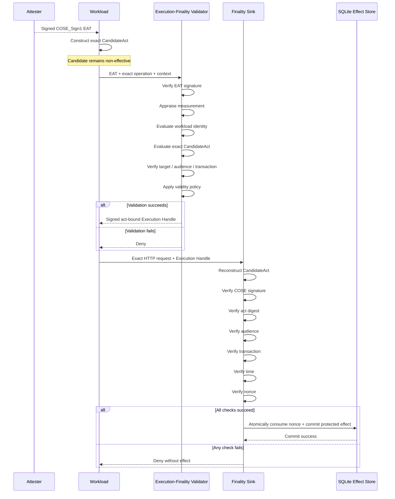

# Execution Finality for GPUs, AI Accelerators, and Confidential Workloads

## Attestation-Bound Execution Finality — Architecture and Working Reference Implementation

Remote attestation can establish important properties of CPUs, confidential virtual machines, GPUs, AI accelerators, DPUs, SmartNICs, firmware, and workload environments.

It can provide evidence about questions such as:

* what hardware or protected execution environment is running;
* what firmware or software measurement is present;
* whether a workload is executing inside an acceptable confidential-computing environment;
* whether the platform satisfies an appraisal policy;
* which workload identity is associated with that environment; and
* whether an Attestation Result is acceptable to a Relying Party.

Those are important trust properties.

They are not necessarily the same question as:

> **Should this exact consequential operation be allowed to become externally effective?**

An acceptable Attestation Result provides trust information to a Relying Party. It does not, without an application-defined authorization decision, determine that every API invocation, infrastructure mutation, storage operation, payment instruction, cross-workload request, or other consequential act subsequently generated by the workload should automatically become effective.

This repository presents an **attestation-bound execution-finality architecture** and a runnable, vendor-neutral implementation of the minimal experimental profile described in:

**`draft-das-rats-attestation-bnd-execution-finality-01`**

The implementation demonstrates one deliberately bounded claim:

> **An attested workload can obtain authorization for one exact HTTP operation, and a protected Finality Sink can independently reject missing authority, modified arguments, changed targets, expired authority, invalid signatures, incorrect context, and replay before a second or altered external effect is committed.**

The broader architecture is applicable to consequence-bearing operations generated by GPUs, AI accelerators, confidential workloads, cloud services, agents, control-plane components, and other computational environments.

The current reference implementation intentionally demonstrates that architecture using a narrow `/transfer` HTTP profile so that the complete security relationship can be executed, tested, inspected, and reproduced.

---

# Core Principle

## Computation is not automatically authority

A workload may be:

* successfully attested;
* cryptographically identified;
* executing inside a confidential VM;
* running on an approved GPU or AI accelerator;
* executing approved software;
* authenticated to another workload;
* authorized to access a service; and
* cryptographically protected in transit.

Those properties are valuable.

They do not necessarily establish that every future operation generated by the workload is the exact operation an authorization function intended to permit.

The architecture therefore separates:

```text
COMPUTE / WORKLOAD PLANE
        |
        | generates
        v
   Candidate Act
   (Non-Effective)
        |
        | evaluated using:
        | attestation
        | workload identity
        | policy
        | scope
        | target
        | freshness
        | transaction context
        v
Execution-Finality Validator
        |
        | issues narrowly scoped,
        | act-bound authority
        v
   Execution Handle
        |
        | accompanies the
        | actual operation
        v
     Finality Sink
        |
        | reconstructs and
        | independently verifies
        v
    External Effect
```

The central invariant is:

> **The operation that becomes externally effective must correspond to the operation that was evaluated and authorized.**

---

# Why Execution Finality?

Remote attestation generally helps determine whether an entity or environment satisfies defined trust requirements.

Execution finality addresses the next question:

> **Once a workload is considered acceptable, what exact consequential operation is that workload authorized to make effective?**

Consider an AI or accelerated workload capable of generating:

* API requests;
* payment instructions;
* infrastructure-management operations;
* storage mutations;
* database changes;
* cross-workload calls;
* model-serving actions;
* control-plane commands;
* network-management instructions;
* tool invocations; or
* other consequence-bearing operations.

Attestation of the workload does not inherently determine:

* which exact operation is authorized;
* which destination is permitted;
* which amount or resource is permitted;
* which HTTP method is authorized;
* which path is authorized;
* which target is authorized;
* which transaction is being executed;
* which Finality Sink may accept the authority;
* how long the authority remains valid; or
* whether that authority has already been consumed.

Execution finality makes these properties explicit and cryptographically enforceable.

---

# Architectural Model

The architecture is built around five load-bearing concepts:

1. **Candidate Act**
2. **Non-Effective State**
3. **Execution-Finality Validator**
4. **Execution Handle**
5. **Finality Sink**

---

# 1. Candidate Act

A **Candidate Act** is a canonical representation of a proposed consequence-bearing operation.

For the current experimental profile, the protected operation is a deliberately narrow HTTP transfer operation such as:

```text
POST /transfer

{
  "destination": "account-B",
  "amount": 100,
  "currency": "USD"
}
```

The Candidate Act captures the security-relevant content necessary to identify the proposed action.

In the implementation, authorization is bound not merely to the fact that a workload is trusted, but to the exact relevant operation.

Conceptually:

```text
CandidateAct =
    method
    + authority
    + path
    + canonical body
    + transaction context
    + relevant target information
```

A deterministic cryptographic representation is then used to derive an act-specific binding.

---

# 2. Non-Effective State

Constructing or generating a Candidate Act does **not** itself cause the protected consequence.

The proposed operation remains in a **Non-Effective State** while authorization is evaluated.

```text
Generated operation ≠ Effective operation
```

An AI model, GPU workload, confidential workload, or software agent may:

* calculate;
* infer;
* prepare;
* serialize;
* recommend; or
* propose

an operation without thereby obtaining unilateral authority to make that operation externally effective.

This distinction is fundamental to the architecture.

---

# 3. Execution-Finality Validator

The **Execution-Finality Validator (EFV)** evaluates the Candidate Act and applicable authorization context.

Its decision may incorporate:

* Attestation Results;
* EAT claims;
* workload identity;
* workload measurement;
* authorization scope;
* target identity;
* Candidate Act contents;
* transaction identity;
* audience;
* policy;
* freshness;
* validity requirements; and
* application-defined execution context.

The question is therefore not merely:

```text
Is this workload trusted?
```

It is closer to:

```text
Is this attested workload authorized
to perform this exact consequential act,
against this target,
for this transaction,
under this policy,
within this validity interval?
```

If validation fails, no valid Execution Handle is issued.

If validation succeeds, the EFV signs narrowly scoped authority cryptographically bound to the Candidate Act.

---

# 4. Execution Handle

Successful validation produces a signed **Execution Handle**.

The Execution Handle represents operation-specific execution authority.

The current profile binds authority to relevant properties including:

* Candidate Act digest;
* audience;
* transaction identity;
* validity information;
* nonce/replay information; and
* cryptographic signature.

The reference implementation uses:

* deterministic CBOR;
* COSE_Sign1;
* Ed25519;
* SHA-256 act binding; and
* bounded validity.

Conceptually:

```text
Execution Handle =
    Sign(
        Candidate Act Digest
        + Audience
        + Transaction Identity
        + Validity
        + Replay-Binding State
    )
```

Possession of authority for one operation therefore does not imply authority for another.

For example:

```text
destination = account-B
amount      = 100
currency    = USD
```

must not silently become:

```text
destination = account-C
amount      = 10000
currency    = USD
```

Changing security-relevant content changes the reconstructed Candidate Act and breaks the expected cryptographic correspondence.

---

# 5. Finality Sink

The **Finality Sink** is the protected boundary where a proposed operation would first acquire external effect.

In this reference implementation, an enforcing HTTP gateway performs that role.

The gateway does not merely trust that an upstream validator previously approved something.

It reconstructs the Candidate Act from the **actual received request** and independently verifies:

* the Execution Handle signature;
* Candidate Act digest;
* audience;
* transaction identity;
* validity interval;
* time constraints;
* replay state;
* nonce state; and
* correspondence between the authorized operation and the presented operation.

Only after these checks succeed is the protected effect committed.

```text
Actual HTTP Request
        +
Execution Handle
        |
        v
+--------------------------------+
|         FINALITY SINK          |
|--------------------------------|
| Reconstruct CandidateAct       |
| Verify COSE signature          |
| Verify act digest              |
| Verify audience                |
| Verify transaction             |
| Verify validity / time         |
| Verify nonce / replay state    |
| Verify exact act correspondence|
+--------------------------------+
        |
       PASS?
      /     \
    NO       YES
    |         |
  Reject    Commit
```

---

# Security Flow

The implemented experimental profile follows this sequence:

1. An **Attester** issues a COSE_Sign1 EAT for an identified workload.
2. The **Execution-Finality Validator** verifies and appraises that EAT.
3. The EFV evaluates the exact canonical payment request.
4. The EFV signs an act-bound COSE_Sign1 **Execution Handle**.
5. The gateway reconstructs the **CandidateAct** from the received HTTP request.
6. The gateway verifies signature, audience, transaction, time, act digest, and nonce.
7. It atomically consumes the nonce and records the protected effect.

The EAT-signing key and Execution-Handle-signing key are independent.

This separation is intentional.

> **An EAT is appraisal input. It is not execution authority.**

An EAT cannot simply be presented to the Finality Sink as permission to perform the operation.

---

# End-to-End Flow



---

# Implemented Experimental Profile

The reference implementation currently provides:

* RFC 8949 deterministic CBOR subset with strict decoding;
* RFC 9052 COSE_Sign1;
* Ed25519 using COSE `alg=-8`;
* EAT/CWT claims;
* private experimental claims for workload and measurement;
* signed EAT issuance;
* EAT signature verification;
* EAT appraisal;
* canonical CandidateAct construction;
* SHA-256 CandidateAct binding;
* fixed canonical JSON body handling for the deliberately narrow `/transfer` operation;
* signed Execution Handles;
* audience-bound authority;
* transaction-bound authority;
* short-lived handles;
* clock-skew checking;
* bounded request sizes;
* bounded token sizes;
* an Execution-Finality Validator service;
* an enforcing HTTP Finality Sink;
* SQLite WAL replay/effect storage;
* `synchronous=FULL`;
* atomic nonce consumption;
* deterministic cryptographic test-vector generation;
* adversarial and negative testing;
* non-diagnostic external denial responses;
* structured internal denial reasons; and
* reproducible latency microbenchmarks.

---

# Important Scope Distinction

The **architecture** is broader than the current executable profile.

The architecture is intended to model consequence-bearing operations involving environments such as:

* GPUs;
* AI accelerators;
* CPUs;
* confidential virtual machines;
* DPUs;
* SmartNICs;
* cloud workloads;
* AI agents;
* control-plane services;
* storage infrastructure;
* external APIs; and
* cross-workload communication.

The **v0.1.0 reference implementation**, however, deliberately narrows the protected effect to one HTTP transfer operation.

That narrow profile makes the security property independently testable without claiming that the software has already been integrated into a commercial GPU, AI accelerator, DPU, SmartNIC, cloud platform, or payment network.

---

# Security Objective

The principal objective is:

> **End-to-end correspondence between the operation evaluated by the authorization function and the operation accepted at the protected effectuation boundary.**

The architecture does not merely establish that:

* a workload was attested;
* a caller authenticated;
* a token was signed;
* a confidential VM was genuine; or
* approved code executed.

Those properties may participate in authorization.

Execution finality additionally binds authority to the exact consequence-bearing operation.

---

# Security Invariants

## 1. Computation does not create authority

```text
Candidate Act ≠ Execution Authority
```

Generating an action does not automatically authorize its external execution.

---

## 2. Attestation is authorization input

A successful Attestation Result can contribute to an authorization decision.

It does not inherently authorize every later action produced by the attested environment.

```text
Attestation
     +
Operation-Specific Validation
     =
Potential Execution Authority
```

---

## 3. Authority is act-bound

The Execution Handle is cryptographically bound to the security-relevant content of the Candidate Act.

Changing the operation after authorization invalidates the expected binding.

---

## 4. Authority is audience-bound

Authority intended for one Finality Sink cannot simply be transferred to an unintended Sink.

---

## 5. Authority is transaction-bound

The transaction identifier participates in the authorization relationship.

A handle cannot be freely detached from the transaction for which it was issued.

---

## 6. Authority is time-bounded

Expired authority is rejected.

---

## 7. Authority is replay-controlled

Previously consumed authority cannot create another committed protected effect.

---

## 8. Finality verification is independent

The Finality Sink performs independent validation against the actual request received for effectuation.

It does not depend solely on an upstream statement that authorization previously occurred.

---

# Reference Implementation Archive

The complete runnable package is distributed as:

```text
execution-finality-reference-v0.1.0.tar.gz
```

The archive includes:

* complete source code;
* implementation documentation;
* security guidance;
* deterministic cryptographic test vectors;
* automated tests;
* adversarial tests;
* benchmark tooling;
* measured benchmark output;
* deployment files; and
* the corresponding Internet-Draft.

This is executable reference software rather than pseudocode.

---

# Runtime Dependency

The only runtime dependency is:

```text
cryptography
```

---

# Run the Tests

Create a virtual environment and install the package:

```bash
python -m venv .venv
. .venv/bin/activate
pip install -e .
```

Run the complete test suite:

```bash
python -m unittest discover -s tests -v
```

Generate deterministic cryptographic vectors:

```bash
python scripts/generate_vectors.py > test-vectors.json
```

Run the local benchmark suite:

```bash
python scripts/benchmark.py
```

---

# Generate Independent Signing Keys

The EAT and Execution Handle signing keys are deliberately separate.

Generate the EAT signing key pair:

```bash
finality generate-keys \
  --private eat-private.pem \
  --public eat-public.pem
```

Generate the Execution-Finality Validator signing key pair:

```bash
finality generate-keys \
  --private handle-private.pem \
  --public handle-public.pem
```

In a real deployment, filesystem private keys are not sufficient for high-assurance production use. Protected or HSM/KMS-backed key custody should be considered where appropriate.

---

# Configure the Reference Services

Set the reference configuration:

```bash
export EAT_KID=eat-1
export HANDLE_KID=efv-1
export EAT_ISSUER=urn:example:attester
export EAT_MEASUREMENT_HEX=1111111111111111111111111111111111111111111111111111111111111111
export EAT_PUBLIC_KEY="$PWD/eat-public.pem"
export HANDLE_PRIVATE_KEY="$PWD/handle-private.pem"
export HANDLE_PUBLIC_KEY="$PWD/handle-public.pem"
export REPLAY_DATABASE="$PWD/finality.sqlite3"
```

Private keys should be readable only by the corresponding service account in a deployment environment.

---

# Run the Two Services

Start the Execution-Finality Validator:

```bash
finality serve-efv --port 8081
```

Start the Finality Sink gateway in a separate terminal:

```bash
finality serve-gateway --port 8080
```

The reference topology is therefore:

```text
                 +---------------------------+
                 | Execution-Finality        |
Candidate ------>| Validator :8081           |
Act + EAT        |                           |
                 +-------------+-------------+
                               |
                               | Execution Handle
                               v
                 +---------------------------+
Actual Request ->| Finality Sink / Gateway   |
+ Handle         | :8080                     |
                 +-------------+-------------+
                               |
                               | verified effect
                               v
                     SQLite Effect Store
```

---

# Issue a Test EAT

Create an EAT for the example workload:

```bash
EAT=$(finality issue-test-eat \
  --private eat-private.pem \
  --kid eat-1 \
  --issuer urn:example:attester \
  --workload ai-agent-47 \
  --measurement "$EAT_MEASUREMENT_HEX")
```

The resulting token represents attestation information about the workload.

It does **not** itself authorize the `/transfer` operation.

---

# Obtain an Execution Handle

Define the exact HTTP request body:

```bash
BODY='{"destination":"account-B","amount":100,"currency":"USD"}'
```

Convert the exact body bytes to base64url form:

```bash
BODY_B64=$(printf %s "$BODY" | base64 | tr '+/' '-_' | tr -d '=\n')
```

Create a transaction identifier:

```bash
TX=tx-0123456789abcdef
```

Request act-specific execution authority from the EFV:

```bash
curl --fail-with-body http://127.0.0.1:8081/v1/execution-handles \
  -H 'Content-Type: application/json' \
  --data "{\"eat\":\"$EAT\",\"method\":\"POST\",\"authority\":\"payments.example\",\"path\":\"/transfer\",\"body\":\"$BODY_B64\",\"audience\":\"urn:example:finality-sink:payments\",\"transaction_id\":\"$TX\"}"
```

The response contains an `execution_handle`.

Extract that value into:

```bash
HANDLE
```

The resulting handle is specific to the relevant operation and context.

---

# Submit the Authorized Operation

Present the exact operation to the Finality Sink:

```bash
curl --fail-with-body http://127.0.0.1:8080/transfer \
  -H "X-Execution-Handle: $HANDLE" \
  -H "X-Transaction-ID: $TX" \
  -H 'Content-Type: application/json' \
  --data-binary "$BODY"
```

If verification succeeds, the reference Finality Sink atomically records the protected effect.

---

# Mutation and Replay Behaviour

The handle is not intended to function as general-purpose bearer authority for arbitrary operations.

Changing security-relevant details makes the handle unusable.

Examples include changing:

```text
amount
destination
HTTP path
audience
transaction ID
```

A valid authorization for:

```json
{
  "destination": "account-B",
  "amount": 100,
  "currency": "USD"
}
```

does not authorize:

```json
{
  "destination": "account-B",
  "amount": 10000,
  "currency": "USD"
}
```

or:

```json
{
  "destination": "account-C",
  "amount": 100,
  "currency": "USD"
}
```

Likewise, presenting the same successfully consumed Execution Handle again is rejected.

---

# Security and Adversarial Tests

The supplied test suite demonstrates rejection of important failure cases.

## Missing Execution Handle

A protected request with no Execution Handle is rejected.

## Amount substitution

A handle issued for one amount cannot authorize a modified amount.

## Destination substitution

Authority for one destination cannot be transferred to another.

## Method or path substitution

Changing the security-relevant HTTP operation invalidates the expected Candidate Act correspondence.

## Incorrect audience

Authority intended for the configured Finality Sink is rejected in an incorrect audience context.

## Transaction mismatch

Changing the transaction identifier invalidates the operation-specific authorization context.

## Expired authority

Handles outside their permitted validity interval are rejected.

## Invalid signature

Modified COSE payloads or signatures fail cryptographic verification.

## Unacceptable attestation measurement

A workload measurement that does not satisfy the configured appraisal profile does not produce acceptable execution authority.

## Replay

A previously consumed Execution Handle cannot create a second protected effect.

---

# Automated Test Result

**Eleven automated tests pass.**

The suite includes an end-to-end HTTP scenario that:

1. starts the Execution-Finality Validator;
2. starts the Finality Sink;
3. issues and appraises an EAT;
4. constructs the exact Candidate Act;
5. requests an act-bound Execution Handle;
6. submits the exact protected HTTP operation;
7. permits the authorized request once;
8. atomically records the protected effect;
9. consumes the relevant replay state; and
10. verifies that replay cannot create a second committed effect.

This demonstrates the complete experimental path from attestation input to operation-specific authorization and protected effectuation.

---

# What Is the Protected Effect?

The reference implementation is **not a real payment system**.

No real funds move.

The protected consequence is an atomic commit to a local SQLite effects table.

This is intentional.

The objective is to demonstrate the security property:

```text
No valid finality authorization
          |
          v
No protected committed effect
```

rather than to simulate or claim production financial infrastructure.

---

# Atomic Replay Protection

The implementation uses SQLite WAL mode with:

```text
synchronous=FULL
```

for the local replay/effect demonstration.

Nonce consumption and protected-effect recording are handled atomically so that a successfully consumed authorization cannot simply be replayed to create another committed consequence.

Conceptually:

```text
Verify Handle
      |
      v
Check nonce unused
      |
      v
+---------------------------+
| Atomic transaction        |
|                           |
| Consume nonce             |
| Record protected effect   |
+---------------------------+
      |
      v
Commit
```

For multi-node production deployments, this local SQLite model would need to be replaced by an appropriately replicated transactional design.

---

# Reference Performance Measurements

Local microbenchmarks measured approximately:

| Operation                     | Median latency |
| ----------------------------- | -------------: |
| EAT appraisal                 |        ~140 μs |
| Candidate Act construction    |        ~1.5 μs |
| Execution Handle issuance     |         ~50 μs |
| Execution Handle verification |        ~140 μs |

These measurements characterize the supplied portable implementation and its local execution environment only.

They are **not** performance claims for:

* NVIDIA GPUs;
* AMD GPUs;
* confidential GPUs;
* AI accelerators;
* DPUs;
* SmartNICs;
* hyperscale cloud systems;
* HSM-backed deployments;
* production payment infrastructure; or
* commercial confidential-computing platforms.

A hardware-integrated system may have materially different characteristics depending on:

* enforcement placement;
* trust-anchor architecture;
* cryptographic acceleration;
* hardware interfaces;
* key-management architecture;
* network topology;
* replay-state architecture;
* deployment scale; and
* operational requirements.

---

# Relationship to IETF RATS

The architecture is intended to **complement**, not replace, the IETF Remote ATtestation procedureS architecture.

A simplified attestation relationship can be represented as:

```text
Attester
   |
Evidence
   v
Verifier
   |
Attestation Result
   v
Relying Party
```

Execution finality uses applicable attestation information as an input to a later operation-specific decision:

```text
Attestation Result
        +
Candidate Act
        +
Workload Identity
        +
Authorization Context
        +
Target
        +
Policy
        +
Freshness
        +
Transaction Context
        |
        v
Execution-Finality Validator
        |
        v
Act-Bound Execution Handle
        |
        v
Finality Sink
        |
        v
External Effect
```

The relationship is therefore:

```text
Attestation
    +
Operation-Specific Authorization
    +
Finality Enforcement
```

rather than:

```text
Attestation = Unlimited Execution Authority
```

---

# Relationship to EAT

Entity Attestation Tokens convey claims about an entity and its execution environment.

In this implementation, EAT is used as an appraisal input.

```text
EAT
 |
 | describes / supplies evidence about
 v
Workload or Environment
```

The Execution Handle has a different function:

```text
Execution Handle
 |
 | authorizes
 v
Specific Candidate Act
```

The two signing keys are independent.

A valid EAT therefore cannot be substituted for a valid Execution Handle.

---

# Relationship to COSE

The implementation uses **COSE_Sign1** for signed cryptographic structures.

COSE provides the signing/message format.

Execution finality defines the authorization relationship between:

* the operation evaluated by the EFV;
* the resulting signed act-specific authority; and
* the operation reconstructed and verified by the Finality Sink.

The architecture therefore composes with existing cryptographic standards rather than replacing them.

---

# Relationship to Workload Identity

Workload identity can answer:

```text
Who or what is making this request?
```

Execution finality adds another question:

```text
What exact operation is this workload authorized
to make externally effective?
```

Both properties can be required.

A trusted workload identity is therefore useful input to the Validator without becoming unrestricted authorization for all operations generated by that workload.

---

# Relationship to Confidential Computing

Confidential computing can protect:

* workload code;
* model state;
* secrets;
* sensitive data;
* inference execution; and
* computation within protected environments.

Execution finality focuses on the next boundary:

> **What happens when protected computation attempts to create a consequence outside the protected compute environment?**

A confidential workload can generate the Candidate Act.

The Candidate Act remains non-effective.

Applicable attestation and authorization information is evaluated.

Only then is narrowly scoped execution authority produced and verified at the protected effectuation boundary.

---

# Relevance to GPUs and AI Accelerators

Modern AI infrastructure increasingly spans:

* GPUs;
* AI accelerators;
* CPUs;
* confidential VMs;
* DPUs;
* SmartNICs;
* model-serving layers;
* orchestration systems;
* service meshes;
* API gateways;
* storage systems; and
* external services.

Attestation can provide evidence about important portions of that environment.

Execution finality addresses the transition from:

```text
The accelerator computed an operation
```

to:

```text
The external system accepted
the operation as authoritative
```

Those are not necessarily the same security event.

The Finality Sink does not have to be physically inside the GPU.

Depending on the deployment architecture, a protected finality boundary could potentially exist at:

* a confidential-computing boundary;
* an accelerator-management boundary;
* a DPU;
* a SmartNIC;
* an API gateway;
* a service-mesh enforcement point;
* an operating-system enforcement point;
* a cloud-control-plane boundary;
* a protected transaction service;
* a workload sidecar; or
* another non-bypassable boundary where external effect first occurs.

The current reference implementation demonstrates the concept with an HTTP gateway.

It does not claim integration with any commercial accelerator.

---

# Non-Bypassability

Finality enforcement is meaningful only if protected consequences cannot bypass the Finality Sink through another uncontrolled route.

A weak deployment would look like:

```text
                    +----> Unprotected API ----> EFFECT
                    |
Workload -----------+
                    |
                    +----> Finality Sink ------> EFFECT
```

The existence of the unprotected path defeats the intended finality property.

A production architecture should instead ensure that protected effects flow through an appropriate enforcement boundary:

```text
Workload
   |
   | consequence-bearing operation
   v
Protected Finality Sink
   |
   v
External Effect
```

How non-bypassability is achieved depends on the actual platform.

---

# Failure Model

The reference profile is designed to fail closed.

```text
Missing Execution Handle    -> REJECT
Invalid signature           -> REJECT
Candidate Act mismatch      -> REJECT
Changed amount              -> REJECT
Changed destination         -> REJECT
Wrong path                  -> REJECT
Wrong audience              -> REJECT
Transaction mismatch        -> REJECT
Expired authority           -> REJECT
Unacceptable attestation    -> REJECT
Consumed nonce / replay     -> REJECT
```

Only the required combination of valid operation, context, authority, and Finality-Sink verification permits the protected effect.

---

# Evidence Before Effectuation

The reference design performs security-relevant validation **before** the protected consequence is committed.

```text
Attestation / Evidence
        |
        v
Operation-Specific Validation
        |
        v
Execution Authority
        |
        v
Finality-Sink Verification
        |
        v
Protected Effect
```

This is different from relying solely on:

```text
Effect
  |
  v
Logging
  |
  v
Audit
```

Logging and audit remain valuable.

They address a different property.

Execution-finality enforcement is intended to prevent an unauthorized or mismatched operation from becoming effective in the first place.

---

# Exact Act Correspondence

A central design objective is to prevent a gap between:

```text
What was evaluated
```

and:

```text
What was actually executed
```

The Candidate Act creates a canonical security-relevant representation.

The Execution Handle cryptographically binds authority to that representation.

The Finality Sink reconstructs the actual operation presented for effectuation.

The security condition is therefore:

```text
Authorized Act == Presented Act
```

If that relationship fails, the protected operation is rejected.

---

# Production Integration Boundaries

The verifier and enforcement logic are suitable for experimentation and embedding, but production deployment requires site-specific engineering.

At minimum, a production integration should consider the following.

### Network protection

Terminate TLS at a hardened ingress or add appropriate TLS protection directly to the service architecture.

### Non-bypassable effectuation

Place the protected downstream effect behind the Finality Sink so there is no alternate uncontrolled route.

### Protected EFV signing keys

Use appropriate HSM-, KMS-, TEE-, or otherwise protected signing-key custody rather than relying on ordinary filesystem private keys.

### Registered attestation profile

Replace experimental/private EAT claims with the deployment's appropriate registered or formally defined EAT profile.

### Distributed replay state

If multiple Finality Sink instances can commit the same consequence, use an appropriately replicated transactional replay/effect store.

### Key lifecycle

Provide:

* provisioning;
* rotation;
* revocation;
* recovery; and
* compromise response.

### Operational controls

Integrate:

* logging;
* metrics;
* monitoring;
* rate limiting;
* policy distribution;
* backups;
* incident response; and
* service-health management.

### Independent security validation

Perform:

* threat modeling;
* dependency review;
* fuzzing;
* penetration testing;
* cryptographic review;
* implementation review; and
* deployment-specific security assessment.

---

# Hardware Integration Requirements

The current implementation is portable reference software.

A hardware-integrated deployment may additionally require:

* platform-specific trust anchors;
* protected key provisioning;
* hardware-backed key management;
* GPU/accelerator attestation integration;
* confidential-VM integration;
* DPU/SmartNIC integration;
* protected firmware paths;
* non-bypassable accelerator-to-effect routes;
* rollback-resistant distributed state;
* device lifecycle management; and
* vendor-specific security review.

The repository does not claim that those integrations have already been completed.

---

# What This Code Demonstrates

The supplied implementation demonstrates executable feasibility of the narrow experimental profile.

Specifically, it demonstrates:

* signed attestation input;
* independent EAT and execution-authority keys;
* EAT verification and appraisal;
* exact Candidate Act construction;
* deterministic operation encoding;
* act-specific hashing;
* signed Execution Handles;
* audience binding;
* transaction binding;
* validity checking;
* exact operation reconstruction;
* Finality-Sink enforcement;
* atomic replay protection;
* mutation rejection;
* deterministic cryptographic vectors;
* negative tests;
* end-to-end HTTP enforcement; and
* reproducible local benchmarks.

In concise form:

```text
Attestation
     |
     v
Candidate Act
     |
     v
Operation-Specific Validation
     |
     v
Signed Act-Bound Execution Handle
     |
     v
Independent Finality-Sink Verification
     |
     v
Atomic Replay Consumption
     |
     v
Protected Effect
```

---

# What This Code Does Not Prove

The implementation does **not** prove:

* patent novelty;
* patent validity;
* IETF adoption;
* standardization;
* universal applicability;
* formal verification of the entire architecture;
* production certification;
* suitability for real financial processing;
* hardware non-bypassability on commercial GPUs;
* integration with NVIDIA GPUs;
* integration with AMD GPUs;
* integration with commercial AI accelerators;
* integration with production DPUs or SmartNICs;
* hyperscale performance; or
* suitability for deployment without independent security review.

The reference implementation is intentionally limited so its demonstrated security properties can be inspected without overstating deployment maturity.

---

# Implementation Status

### Demonstrated

**✓ Runnable source code**

**✓ Vendor-neutral implementation**

**✓ Real cryptographic signatures**

**✓ Deterministic CBOR**

**✓ COSE_Sign1**

**✓ Ed25519**

**✓ Signed EAT issuance and appraisal**

**✓ Act-bound Execution Handles**

**✓ HTTP Finality Sink enforcement**

**✓ Atomic replay protection**

**✓ Positive and adversarial tests**

**✓ Eleven passing automated tests**

**✓ End-to-end HTTP test**

**✓ Deterministic cryptographic vectors**

**✓ Reproducible local benchmarks**

### Not claimed

**✗ Production-certified accelerator software**

**✗ Commercial GPU integration**

**✗ Commercial DPU/SmartNIC integration**

**✗ Certified cloud security product**

**✗ Production payment processor**

**✗ Hyperscale benchmark result**

**✗ Completed platform-specific non-bypassability integration**

The software is appropriately described as:

> **A working, production-oriented reference implementation and interoperability demonstrator for attestation-bound execution finality.**

---

# Intended Audience

This repository may be relevant to:

* GPU security engineers;
* AI-accelerator engineers;
* confidential-computing engineers;
* cloud-infrastructure engineers;
* workload-identity engineers;
* API-security engineers;
* IETF RATS participants;
* EAT implementers;
* COSE implementers;
* DPU and SmartNIC engineers;
* cloud-control-plane architects;
* AI infrastructure researchers;
* agentic-AI security researchers; and
* engineers studying authorization boundaries for autonomous workloads.

---

# Summary

Remote attestation can establish whether a workload or computational environment satisfies defined trust requirements.

Execution finality addresses a separate question:

> **What exact consequential operation is that workload authorized to make externally effective?**

The architecture therefore introduces a sequence in which:

1. an attested workload generates a **Candidate Act**;
2. the Candidate Act remains in a **Non-Effective State**;
3. the **Execution-Finality Validator** evaluates attestation, identity, exact operation, target, policy, audience, freshness, and transaction context;
4. successful validation produces a signed, narrowly scoped **Execution Handle**;
5. the actual operation is presented to the **Finality Sink**;
6. the Finality Sink reconstructs the Candidate Act and independently verifies the signature, digest, audience, transaction, validity, and replay state; and
7. only the verified operation is permitted to create the protected external effect.

```text
Attested Workload
        |
        v
Candidate Act
        |
        v
Non-Effective State
        |
        v
Execution-Finality Validator
        |
        v
Act-Bound Execution Handle
        |
        v
Finality Sink
        |
        v
Protected External Effect
```

The proposed contribution is therefore not another mechanism for proving that trusted computation occurred.

It is an architecture for preserving cryptographic correspondence between:

> **the consequential operation that was evaluated**

and

> **the consequential operation that is ultimately permitted to take effect.**

## # Technical FAQ

## 1. Why is remote attestation itself not sufficient?

Remote attestation establishes properties of an execution environment—for example, workload identity, measurements, firmware state, or confidential-computing status.

It does not inherently determine whether every future consequence generated by that environment is authorized.

Execution finality therefore treats an Attestation Result as an **authorization input**, not as unrestricted execution authority.

The additional question is:

> **Is this attested workload authorized to make this exact consequential operation externally effective?**

---

## 2. Is this architecture proposing a replacement for GPU attestation or IETF RATS?

No.

The architecture is explicitly complementary to:

* GPU and accelerator attestation;
* confidential-computing attestation;
* IETF RATS;
* EAT;
* COSE;
* workload identity;
* mTLS;
* OAuth-style authorization; and
* platform-specific trust mechanisms.

Attestation establishes trusted state.

Execution finality binds that trusted state and applicable policy to **a specific consequence-bearing operation**.

---

## 3. Where would the Finality Sink actually reside in a GPU deployment?

It is intentionally location-neutral.

Depending on the system architecture, a Finality Sink could be implemented at:

* a protected GPU-management boundary;
* a confidential-VM boundary;
* a DPU;
* a SmartNIC;
* an API gateway;
* a service-mesh enforcement point;
* a cloud control-plane component;
* a protected storage interface;
* a transaction service; or
* another non-bypassable boundary where an operation first becomes externally effective.

The reference implementation uses an HTTP gateway because it provides a simple, independently testable effectuation boundary.

It does **not** claim that the current implementation is already embedded inside a commercial GPU.

---

## 4. Does every CUDA kernel invocation need an Execution Handle?

No.

Execution finality is intended for **consequence-bearing operations**, not every computational instruction.

GPU arithmetic, tensor operations, kernel launches, memory-local transformations, and inference steps can occur normally.

The relevant point is the transition from computation to an externally consequential operation.

For example:

```text
GPU computation
      |
      | no finality check required
      v
Model inference
      |
      | generates proposed external operation
      v
Candidate Act
      |
      v
Execution-Finality Validation
      |
      v
External API / Storage / Control / Transaction Effect
```

The architecture therefore does not require cryptographic authorization of every matrix multiplication or kernel execution.

---

## 5. What exactly is being cryptographically bound?

The reference profile binds the Execution Handle to security-relevant properties of the Candidate Act and execution context.

These include, as applicable:

* operation digest;
* HTTP method;
* authority or target;
* path;
* canonical request body;
* audience;
* transaction identity;
* validity interval; and
* replay-related state.

If a load-bearing field changes after authorization, the Finality Sink reconstructs a different Candidate Act and the authorization no longer matches.

---

## 6. How does this prevent TOCTOU between validation and execution?

The architecture does not rely solely on the object examined by the Validator.

The **Finality Sink reconstructs the operation actually presented for effectuation**.

It then recomputes the relevant act binding and compares it against the signed authorization.

The sequence is therefore:

```text
Proposed operation
      |
      v
Validate
      |
      v
Signed act-specific authority
      |
      v
Actual operation arrives
      |
      v
Reconstruct actual Candidate Act
      |
      v
Compare with authorized digest
      |
      v
Effect only if identical
```

This is intended to close the gap between **what was authorized** and **what was actually presented for execution**.

---

## 7. What stops a compromised host from bypassing the Finality Sink?

Nothing in a portable software library can guarantee non-bypassability if the protected target remains reachable through another uncontrolled path.

Production deployment therefore requires the effectuation topology itself to enforce:

```text
Workload
   |
   v
Protected Finality Sink
   |
   v
Target
```

rather than:

```text
             +--> Finality Sink --> Target
Workload ----+
             +--------------------> Target
```

If an alternate unprotected route exists, the finality property can be bypassed.

For GPU or accelerator integration, establishing this non-bypassability is a platform-specific engineering requirement.

---

## 8. Would putting the Finality Sink inside a DPU or SmartNIC make sense?

Potentially.

A DPU or SmartNIC can be an attractive enforcement location when the externally consequential operation crosses that device and the workload cannot bypass it.

Possible examples include:

* network API requests;
* storage traffic;
* service-to-service calls;
* cloud-control operations; and
* remote transaction messages.

However, the architecture does not require a DPU or SmartNIC.

The correct location is determined by **where external effect first becomes enforceable and non-bypassable**.

---

## 9. Could the Finality Sink be implemented inside GPU firmware or accelerator hardware?

Conceptually yes, where appropriate platform primitives exist.

The architecture is not restricted to software gateways.

A future implementation could place validation or finality functionality in:

* accelerator firmware;
* protected microcontrollers;
* GPU security processors;
* hardware-rooted enforcement domains;
* DPUs;
* SmartNICs;
* TEEs; or
* other protected hardware boundaries.

The current code does not claim that such integration has been completed.

---

## 10. Is the Execution Handle just another bearer token?

The design goal is narrower than a conventional general-purpose bearer credential.

An Execution Handle is bound to a specific Candidate Act and execution context.

Possession of a valid handle for:

```text
POST /transfer
amount = 100
destination = account-B
```

does not authorize:

```text
POST /transfer
amount = 10,000
destination = account-C
```

because the security-relevant operation digest differs.

The current experimental implementation still transports the signed handle to the Finality Sink, so production designs should also consider theft, channel binding, sender constraints, protected key custody, and deployment-specific proof-of-possession mechanisms where required.

---

## 11. Why use separate EAT-signing and Execution-Handle-signing keys?

Because they represent different trust functions.

The EAT-signing key establishes claims about:

> **the workload or environment**

while the EFV signing key establishes:

> **authorization for a specific operation**

Keeping the keys separate prevents the attestation credential itself from being treated as execution authority.

Conceptually:

```text
EAT key
   |
   v
"This environment has these properties"

EFV key
   |
   v
"This exact act is authorized under this context"
```

---

## 12. What if the Execution-Finality Validator itself is compromised?

Then the Validator could potentially issue unauthorized Execution Handles.

The EFV therefore becomes a security-critical authorization component.

A production implementation should consider:

* protected signing keys;
* HSM/KMS-backed keys;
* policy isolation;
* measured or attested EFV execution;
* separation of duties;
* short-lived authority;
* auditability;
* key rotation;
* rate controls; and
* independent policy verification.

The architecture does not eliminate the need to protect the authorization authority itself.

---

## 13. Could the EFV itself run inside a confidential VM or TEE?

Yes.

That could strengthen protection of:

* authorization policy;
* signing keys;
* workload context;
* sensitive transaction data; and
* the authorization decision.

The architecture does not prescribe where the EFV must execute.

A hardware-rooted EFV is one possible production deployment.

---

## 14. How are replay attacks handled?

The reference implementation uses single-use state and atomic nonce consumption.

The Finality Sink checks whether the relevant authority has already been consumed.

For a successful operation, replay-state consumption and protected-effect recording occur atomically.

A second presentation is rejected.

For distributed production systems, local SQLite state would need to be replaced with a replicated, strongly consistent or otherwise appropriately designed transaction/replay mechanism.

---

## 15. What happens with multiple Finality Sink replicas?

The current local reference profile demonstrates atomicity using SQLite.

A horizontally scaled deployment cannot safely rely on independent local replay databases if multiple gateways can commit the same consequence.

Production deployment would require shared or distributed state capable of preserving the relevant single-use/transaction semantics.

Potential designs depend on the target environment and could include:

* strongly consistent transactional stores;
* partitioned nonce ownership;
* consensus-backed state;
* target-system conditional writes; or
* target-native idempotency mechanisms combined with finality verification.

The repository intentionally does not claim to solve distributed consensus.

---

## 16. Does deterministic CBOR matter if the protected operation is JSON?

Yes.

Cryptographic authorization requires both sides to agree on exactly what bytes or semantic representation are being bound.

The reference implementation uses deliberately constrained canonicalization so that:

```text
Validator representation
        ==
Finality Sink representation
```

for the security-relevant operation.

In a broader implementation, canonicalization rules would need to be precisely defined for each protected protocol or operation family.

---

## 17. What happens with semantically equivalent but byte-different requests?

That depends on the Candidate Act definition.

The architecture should bind the **security-relevant canonical semantics**, not arbitrary transport formatting where possible.

For example, differences such as insignificant whitespace should not create ambiguity if the defined canonicalization removes them.

However, any field that can alter the consequence must remain load-bearing.

The narrow reference profile deliberately minimizes canonicalization complexity.

---

## 18. How would this work for streaming AI output?

Not every token needs a Finality Handle.

The system can distinguish between:

```text
Model output generation
```

and:

```text
a proposed consequential act derived from that output
```

For streaming or agentic systems, a Candidate Act can be created when the workload proposes a consequential operation.

Examples include:

* invoking an external tool;
* committing a database mutation;
* issuing a cloud-control command;
* sending a payment;
* modifying infrastructure; or
* sending externally consequential network traffic.

The exact granularity is deployment-specific.

---

## 19. What about batched GPU operations?

The Candidate Act abstraction can represent either:

* one individual operation; or
* an explicitly defined batch,

provided the authorization semantics are unambiguous.

If a batch is authorized as a unit, the digest must bind the security-relevant contents of that batch.

The Finality Sink must then verify the same batch semantics before effectuation.

---

## 20. Does this add another network round trip to every action?

The reference profile performs explicit EFV authorization before effectuation, but the architecture does not require one universal deployment topology.

Possible implementations could colocate validation with:

* the workload;
* a DPU;
* an accelerator-management domain;
* the Finality Sink;
* a local sidecar;
* a service-mesh component; or
* another trusted boundary.

The latency measurements in the current implementation characterize only the portable implementation.

They do not represent production GPU or hyperscale latency.

---

## 21. Is the measured ~140 μs verification latency fast enough for accelerator workloads?

The current number should not be interpreted as a hardware-performance claim.

The supplied measurements are useful only as reproducible measurements of the portable reference code.

For a production accelerator environment, performance would depend heavily on:

* placement of verification;
* cryptographic acceleration;
* hardware signing/verification;
* batching;
* caching of attestation results;
* network topology;
* replay-state architecture; and
* whether validation occurs locally or remotely.

The important architectural point is that **attestation appraisal does not necessarily need to be repeated for every low-level GPU instruction**.

---

## 22. Does every operation require fresh remote attestation?

Not necessarily.

The architecture permits Attestation Results to be inputs subject to freshness and policy requirements.

A production system could potentially reuse a still-valid attestation result while issuing multiple distinct act-bound authorizations.

For example:

```text
Attestation Result
        |
        +---- Candidate Act A -> Handle A
        |
        +---- Candidate Act B -> Handle B
        |
        +---- Candidate Act C -> Handle C
```

Each consequence-bearing operation receives separate authority even though the attestation state may remain acceptable.

---

## 23. What happens if GPU state changes after attestation?

That becomes a freshness and trust-continuity problem.

Possible platform-specific responses include:

* shorter attestation validity;
* runtime measurements;
* epoch binding;
* configuration-version binding;
* device reset detection;
* revocation;
* periodic re-attestation; or
* hardware-provided continuity mechanisms.

Execution finality does not replace those mechanisms.

It can incorporate their resulting trust state into the act-specific authorization decision.

---

## 24. How is this different from mTLS or workload identity?

mTLS and workload identity establish who or what is communicating.

They generally do not by themselves establish cryptographic correspondence between:

> **the exact operation approved**

and

> **the exact operation ultimately effected**.

Execution finality can use workload identity as one authorization input while additionally binding authority to the Candidate Act.

---

## 25. How is this different from OAuth?

OAuth can provide scoped authorization to access a resource.

Execution finality focuses specifically on ensuring that a consequence-bearing operation is bound to the concrete act ultimately accepted at the protected effectuation boundary.

The architectures can compose.

For example:

```text
OAuth / workload authorization
            +
Attestation Result
            +
Candidate Act
            v
Execution-Finality Validator
            |
            v
Act-Bound Execution Handle
            |
            v
Finality Sink
```

The proposal is not that OAuth should be replaced.

---

## 26. Why isn't normal API validation at the target enough?

It may be enough for some systems.

Execution finality becomes useful where a system needs an explicit cryptographic relationship among:

1. the attested workload;
2. the authorization decision;
3. the exact proposed act; and
4. the actual act reaching the effectuation boundary.

The architecture is therefore most relevant where the separation between trusted computation and consequential authority matters.

---

## 27. Does the Finality Sink have to trust the EFV completely?

It trusts the EFV's authorized signing key for authorization decisions, but it does **not blindly trust the operation representation received from the EFV**.

The Finality Sink independently reconstructs the actual Candidate Act and verifies that its digest matches the signed authority.

This preserves separation between:

```text
Authorization decision
```

and:

```text
Actual effectuation
```

---

## 28. Could an attacker modify the operation after the handle is issued?

The attacker may be able to modify transport data, depending on the threat model.

But if a security-relevant operation field changes, the Finality Sink reconstructs a different Candidate Act.

The digest no longer matches the signed authorization and the operation is rejected.

This is one of the primary properties demonstrated by the adversarial tests.

---

## 29. Why is the effect stored in SQLite instead of executing a real GPU/cloud/payment action?

To isolate and demonstrate the finality property without introducing unrelated production-system complexity.

The protected effect in v0.1.0 is an atomic database commit.

That makes it possible to test:

```text
valid authorization -> exactly one effect
replay              -> no second effect
modified operation  -> no effect
```

without claiming production payment, cloud, or accelerator integration.

---

## 30. What would be required for a genuine NVIDIA or accelerator integration?

The protocol logic alone is not enough.

A production accelerator integration would need platform-specific work including:

* connection to actual accelerator attestation evidence;
* validation of the relevant attestation profile;
* device/workload identity binding;
* secure EFV key custody;
* protected control paths;
* placement of the Finality Sink;
* proof that consequential operations cannot bypass that Sink;
* distributed replay and transaction state;
* hardware reset/epoch handling;
* lifecycle and revocation handling;
* performance characterization;
* fault analysis;
* threat modeling;
* fuzzing;
* penetration testing; and
* independent security review.

The current repository is intended to make the **execution-finality protocol relationship executable and inspectable before such vendor-specific integration is attempted**.

---

# One-Sentence Engineering Summary

> **Attestation establishes whether the workload is acceptable; execution finality determines whether the exact act produced by that workload is authorized to cross the boundary into external effect.**

