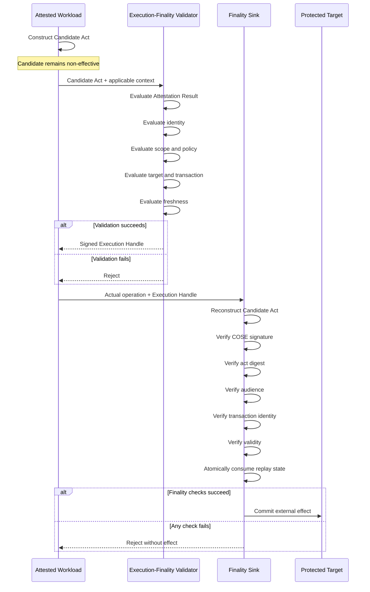

# Execution Finality for GPUs, AI Accelerators, and Confidential Workloads

## Architecture and Working Reference Implementation

Remote attestation can establish important properties of CPUs, confidential virtual machines, GPUs, AI accelerators, DPUs, SmartNICs, firmware, and workload environments.

Attestation can provide evidence about questions such as:

* What hardware or protected environment is executing?
* What software or firmware measurement is present?
* Is the workload running within an acceptable confidential-computing environment?
* Does the platform satisfy an appraisal policy?
* Is a particular workload identity associated with the attested environment?

Those are important trust questions.

They are not necessarily the same question as:

> **Should this specific consequential operation be allowed to become externally effective?**

An acceptable Attestation Result supplies trust information to a Relying Party. It does not, without an application-defined authorization decision, mean that every operation subsequently generated by that attested workload should automatically acquire external effect.

This repository explores that distinction through an **attestation-bound execution-finality architecture**.

The architecture introduces an explicit boundary between:

**trusted or attested computation**

and

**authority to create an external consequence.**

The accompanying software is a runnable, vendor-neutral reference implementation demonstrating how an operation generated by an attested workload can remain non-effective until operation-specific authority is created and independently verified at the point where the operation would actually take effect.

---

# Core Principle

## Computation is not automatically authority

A workload may be:

* successfully attested;
* cryptographically identified;
* executing inside a confidential VM;
* running on an approved GPU or accelerator;
* executing approved software;
* authenticated to another workload;
* authorized to access a service; and
* cryptographically protected in transit.

Those properties are valuable.

They do not necessarily prove that every future operation generated by the workload is the exact operation that an authorization function intended to permit.

This architecture therefore separates:

```text
COMPUTE PLANE
     |
     | produces
     v
Candidate Act
(Non-Effective)
     |
     | evaluated using attestation,
     | identity, policy, scope,
     | target, freshness and context
     v
Execution-Finality Validator
     |
     | issues narrowly scoped,
     | act-bound authority
     v
Execution Handle
     |
     | presented with actual operation
     v
Finality Sink
     |
     | reconstructs + independently verifies
     v
External Effect
```

The central invariant is:

> **The operation that becomes externally effective must correspond to the operation that was evaluated and authorized.**

---

# Why Execution Finality?

Remote attestation generally answers questions about the trustworthiness or state of an environment.

Execution finality addresses a different problem:

> How can a system ensure that a consequential action becomes externally effective only if the exact action presented at the effectuation boundary corresponds to an operation-specific authorization decision?

Consider an AI or accelerated workload capable of generating:

* API requests;
* infrastructure-management commands;
* storage mutations;
* database transactions;
* payment instructions;
* workload-to-workload requests;
* control-plane operations;
* network-management instructions;
* external tool calls; or
* other consequence-bearing actions.

Even where the workload itself is successfully attested, an authorization architecture may still need to determine:

* which operation is being attempted;
* which target is affected;
* which amount or resource is involved;
* which destination is intended;
* which HTTP method and path are authorized;
* which transaction is being executed;
* which Finality Sink may accept the authority;
* how long that authority remains valid; and
* whether the authority has already been consumed.

Execution finality makes these properties explicit.

---

# Architectural Model

The reference architecture contains four primary concepts:

1. **Candidate Act**
2. **Non-Effective State**
3. **Execution-Finality Validator**
4. **Finality Sink**

A signed **Execution Handle** connects the authorization decision to the protected effectuation boundary.

---

# 1. Candidate Act

A **Candidate Act** is a canonical representation of a proposed consequence-bearing operation.

Examples could include:

```text
POST /payments
amount = 100
currency = EUR
destination = merchant-A
```

or:

```text
PUT /infrastructure/workload/123
operation = restart
region = eu-west
```

or:

```text
POST /storage/object
object = model-output-7281
destination = protected-bucket
```

The Candidate Act contains the security-relevant information necessary to identify what is being proposed.

The reference implementation constructs Candidate Acts using deterministic encoding and derives an act-specific cryptographic digest.

The purpose is to ensure that authorization applies to a defined operation rather than merely to the workload in the abstract.

---

# 2. Non-Effective State

Creation of a Candidate Act does **not** itself cause the requested external consequence.

The proposed operation remains in a **Non-Effective State** while authorization is being evaluated.

Conceptually:

```text
Generated operation ≠ Effective operation
```

and:

```text
Candidate Act
      |
      X
No external effect yet
```

This separation is important.

The workload may compute, infer, prepare, serialize, or propose an operation without possessing unilateral authority to make that operation externally effective.

Only after the applicable validation process succeeds can narrowly scoped execution authority be created.

---

# 3. Execution-Finality Validator

The **Execution-Finality Validator** evaluates the Candidate Act.

Its decision can incorporate applicable information including:

* Attestation Results;
* workload identity;
* authorization scope;
* target identity;
* Candidate Act contents;
* transaction identity;
* policy;
* freshness;
* execution context; and
* other application-defined authorization inputs.

The Validator therefore does not merely ask:

```text
Is this workload trusted?
```

It can instead evaluate:

```text
Is this attested workload authorized to perform
this exact consequential operation,
against this target,
under this context,
within this validity interval?
```

If validation fails, no valid Execution Handle is issued.

If validation succeeds, the Validator creates narrowly scoped cryptographic authority bound to the Candidate Act.

---

# 4. Execution Handle

Successful validation produces a signed **Execution Handle**.

The Execution Handle represents act-specific authority.

The supplied implementation binds the handle to security-relevant context including:

* Candidate Act digest;
* audience;
* transaction identity;
* validity information; and
* replay-protection state.

The reference implementation uses:

* deterministic CBOR;
* COSE_Sign1;
* Ed25519 signatures; and
* SHA-256 act binding.

Conceptually:

```text
Execution Handle =
    Sign(
        Act Digest
        + Audience
        + Transaction Context
        + Validity
        + Replay-Binding Information
    )
```

This means possession of a handle for one authorized operation should not authorize a materially different operation.

For example, authorization for:

```text
amount = 100
destination = A
```

must not become authorization for:

```text
amount = 10,000
destination = B
```

Changing security-relevant content changes the reconstructed Candidate Act and therefore breaks the expected binding.

---

# 5. Finality Sink

The **Finality Sink** is the protected boundary at which the proposed operation would first acquire external effect.

In the supplied reference implementation, an enforcing HTTP API gateway demonstrates this role.

The Finality Sink does not simply trust that upstream validation occurred.

Instead, it independently reconstructs the operation presented for effectuation and verifies the corresponding authority.

The verification includes applicable checks such as:

* cryptographic signature;
* Candidate Act digest;
* audience;
* transaction identity;
* validity interval;
* replay state; and
* correspondence between the authorized act and the actual requested operation.

Only after those checks succeed may the external effect occur.

Conceptually:

```text
Actual Request
      +
Execution Handle
      |
      v
+---------------------------+
|       Finality Sink       |
|---------------------------|
| Verify signature          |
| Reconstruct Candidate Act |
| Compute act digest        |
| Verify audience           |
| Verify transaction        |
| Verify freshness          |
| Verify replay state       |
| Verify exact binding      |
+---------------------------+
      |
   PASS?
   /   \
 NO     YES
 |       |
Reject   Effect
```

---

# End-to-End Execution Flow

The architecture can be summarized as the following sequence.



---

# Security Objective

The principal security objective is:

> **End-to-end correspondence between the operation evaluated by the authorization function and the operation accepted at the protected effectuation boundary.**

This is stronger than merely proving that:

* a workload was attested;
* a caller authenticated;
* a token was valid;
* a confidential VM was genuine; or
* an accelerator executed approved software.

Those properties can participate in the decision.

Execution finality additionally binds authority to the consequence-bearing operation itself.

---

# Security Invariants

The reference architecture is designed around several important invariants.

## Invariant 1 — No authority from computation alone

Generating or computing an operation does not automatically authorize its external execution.

```text
Candidate Act ≠ Authority
```

---

## Invariant 2 — Attestation is an input, not universal authorization

A successful Attestation Result may inform an authorization decision.

It does not inherently authorize every future consequence produced by the attested workload.

```text
Successful Attestation
        +
Operation-Specific Validation
        =
Potential Execution Authority
```

---

## Invariant 3 — Authority is act-bound

Execution authority is cryptographically bound to the security-relevant content of the Candidate Act.

Changing the operation after authorization must invalidate the binding.

---

## Invariant 4 — Authority is audience-bound

Authority intended for one Finality Sink should not automatically be accepted by another.

This reduces cross-service or cross-boundary reuse.

---

## Invariant 5 — Authority is transaction-bound

Transaction context participates in the authorization relationship so that authority cannot be freely detached from the transaction for which it was created.

---

## Invariant 6 — Authority is time-bounded

Expired authority must be rejected.

---

## Invariant 7 — Authority is replay-controlled

Previously consumed authority must not be reusable to create a second committed external effect.

The reference implementation demonstrates atomic replay protection using SQLite transactions.

---

## Invariant 8 — The Finality Sink independently verifies

The protected effectuation boundary performs its own verification rather than relying only on an upstream statement that validation occurred.

---

# Reference Implementation

The repository includes the downloadable source archive:

**`execution-finality-reference-v0.1.0.tar.gz`**

The archive contains the complete runnable implementation and supporting material.

It includes:

* source code;
* implementation documentation;
* security guidance;
* deterministic cryptographic test vectors;
* automated tests;
* adversarial tests;
* benchmark scripts;
* measured benchmark output;
* deployment files; and
* the corresponding Internet-Draft.

The implementation is intended to provide an executable demonstration of the architecture rather than only a conceptual specification or pseudocode description.

---

# Implemented Cryptographic and Protocol Components

The reference implementation includes the following components.

## Deterministic CBOR

Candidate and authorization structures use deterministic CBOR encoding conforming to the relevant requirements of RFC 8949.

Deterministic encoding is important because cryptographic binding requires different implementations to derive the same byte representation for the same security-relevant content.

---

## COSE_Sign1

Signed objects use **COSE_Sign1**.

This provides a standards-oriented structure for cryptographically signing authorization and attestation-related objects.

---

## Ed25519

The portable reference implementation uses **Ed25519** for signing and verification.

The implementation choice demonstrates the protocol flow and cryptographic binding.

Production integrations may require platform-specific key custody, trust anchors, hardware-backed signing, protected key material, or other deployment-specific mechanisms.

---

## Entity Attestation Tokens

The implementation provides signed **Entity Attestation Token (EAT)** issuance, verification, and appraisal.

Attestation information can therefore participate in the Execution-Finality Validator's decision.

The architecture intentionally keeps two concepts distinct:

```text
Attestation Result
      |
      v
Authorization Input
```

rather than:

```text
Attestation Result
      |
      v
Unlimited Execution Authority
```

---

## Candidate Act Construction

The implementation canonically represents the proposed operation before authorization.

Security-relevant fields are included in the cryptographic act binding.

---

## SHA-256 Act Binding

A cryptographic digest of the canonical Candidate Act is incorporated into the Execution Handle.

At the Finality Sink, the operation is reconstructed and the expected digest is calculated again.

A security-relevant modification therefore produces a different act digest.

---

## Execution Handles

Execution Handles are:

* signed;
* act-bound;
* audience-bound;
* transaction-bound;
* validity-constrained; and
* subject to replay protection.

They represent narrowly scoped execution authority rather than general proof that a workload is trusted.

---

## Execution-Finality Validator Service

The implementation includes an **Execution-Finality Validator service** responsible for evaluating the Candidate Act and applicable trust and authorization inputs.

On successful evaluation, it issues an act-specific Execution Handle.

---

## Enforcing API Gateway

An HTTP API gateway acts as the reference **Finality Sink**.

It demonstrates that enforcement can occur at a concrete effectuation boundary rather than existing solely as an advisory validation result.

The gateway reconstructs the actual request and independently verifies the Execution Handle before allowing the protected operation to commit.

---

## Atomic Replay Protection

The reference implementation uses SQLite transactions to demonstrate atomic nonce consumption.

The objective is to ensure that previously consumed authority cannot be presented again to produce an additional committed consequence.

A successful first execution therefore changes replay state before subsequent use can be accepted.

---

# Adversarial Test Coverage

The implementation includes negative and adversarial tests intended to demonstrate fail-closed behavior for important substitution and replay cases.

The supplied test suite demonstrates rejection of:

### Missing authority

A consequence-bearing request without the required Execution Handle is rejected.

### Amount substitution

An Execution Handle created for one amount cannot be used to authorize a modified amount.

### Destination substitution

Authority issued for one destination cannot be transferred to a different destination.

### HTTP method substitution

Changing the authorized HTTP method causes the reconstructed operation to differ from the authorized Candidate Act.

### HTTP path substitution

Changing the protected path similarly invalidates the expected act correspondence.

### Audience mismatch

Authority issued for one Finality Sink audience is rejected by an incorrect audience.

### Expired authority

Handles outside their permitted validity interval are rejected.

### Signature or payload alteration

Modified COSE payloads or signatures fail cryptographic verification.

### Unacceptable attestation measurements

Attestation evidence that does not satisfy the configured appraisal requirements does not result in acceptable authorization.

### Replay

Previously consumed execution authority cannot be reused to create a second committed effect.

---

# Automated Test Results

**Eleven automated tests pass successfully.**

The test suite includes an end-to-end HTTP validation and enforcement scenario that:

1. starts the Execution-Finality Validator;
2. starts the Finality Sink;
3. constructs an operation-specific Candidate Act;
4. obtains a corresponding Execution Handle;
5. presents the exact authorized HTTP request;
6. allows the authorized request to proceed once;
7. records consumption of the authority; and
8. verifies that replay cannot create a second committed effect.

This demonstrates the complete reference flow from authorization through effectuation-boundary enforcement.

---

# Reference Performance Measurements

Local microbenchmarks of the portable implementation measured approximately:

| Operation                     | Median measured latency |
| ----------------------------- | ----------------------: |
| EAT appraisal                 |                 ~140 μs |
| Candidate Act construction    |                 ~1.5 μs |
| Execution Handle issuance     |                  ~50 μs |
| Execution Handle verification |                 ~140 μs |

These measurements characterize the supplied reference implementation and the environment in which the measurements were obtained.

They are provided to make the implementation experimentally inspectable.

They are **not** claims regarding:

* NVIDIA GPUs;
* AMD GPUs;
* AI accelerators;
* confidential GPUs;
* DPUs;
* SmartNICs;
* hardware security modules;
* production cloud control planes;
* hyperscale infrastructure;
* production payment networks; or
* commercial confidential-computing platforms.

Performance in a hardware-integrated deployment depends on architecture, placement of enforcement functions, cryptographic acceleration, trust-anchor design, key management, network topology, replay-state design, hardware interfaces, and operational requirements.

---

# Relationship to Remote Attestation

Execution finality is intended to **complement**, not replace, remote attestation.

A simplified attestation architecture may resemble:

```text
Attester
   |
Evidence
   v
Verifier
   |
Attestation Result
   v
Relying Party
```

The execution-finality architecture uses applicable Attestation Results as inputs to a subsequent operation-specific decision:

```text
Attestation Result
      +
Candidate Act
      +
Workload Identity
      +
Authorization Scope
      +
Target
      +
Policy
      +
Freshness
      +
Transaction Context
      |
      v
Execution-Finality Validator
      |
      v
Act-Bound Execution Handle
      |
      v
Finality Sink
```

The architectural distinction is therefore not:

```text
Attestation OR Execution Finality
```

but rather:

```text
Attestation + Operation-Specific Authorization + Finality Enforcement
```

---

# Relationship to IETF RATS

The architecture complements the **IETF Remote ATtestation procedureS (RATS)** architecture.

RATS provides a framework for producing, conveying, verifying, and consuming attestation evidence and results.

Execution finality begins from a different but complementary question:

> Once applicable attestation information has been obtained, how can authority for a particular consequence-bearing operation be bound to that operation and verified at the point of effectuation?

Accordingly, an Attestation Result can be a load-bearing input to the Execution-Finality Validator without being treated as unrestricted authority for all actions generated by the attested environment.

---

# Relationship to EAT

**Entity Attestation Tokens (EAT)** provide a structured mechanism for conveying claims relevant to attestation.

The reference implementation includes signed EAT issuance, verification, and appraisal.

EAT information contributes to the trust assessment.

Execution Handles serve a different purpose: they carry narrowly scoped authority bound to a particular Candidate Act and Finality Sink context.

Conceptually:

```text
EAT
 |
 | says something about
 v
Entity / Environment State

Execution Handle
 |
 | authorizes
 v
Specific Candidate Act
```

---

# Relationship to COSE

The reference implementation uses **COSE_Sign1** to provide signed cryptographic structures.

COSE supplies the cryptographic message format.

Execution finality defines how signed authority is bound to a Candidate Act and how that authority is subsequently verified at an effectuation boundary.

The architecture therefore uses existing cryptographic building blocks rather than proposing a replacement for them.

---

# Relationship to Workload Identity

Workload identity can establish:

```text
Who or what is making the request?
```

Execution finality additionally asks:

```text
What exact operation is this workload authorized to make effective?
```

The concepts are complementary.

A workload identity may therefore be incorporated into the Execution-Finality Validator's decision while the resulting Execution Handle remains bound to the specific operation.

---

# Relationship to Confidential Computing

Confidential computing can protect:

* code;
* data;
* model state;
* workload execution;
* secrets; and
* sensitive computation

within appropriately protected execution environments.

Execution finality addresses another point in the lifecycle:

> What happens when protected computation attempts to cause a consequence outside that protected environment?

An accelerator or confidential workload can generate a Candidate Act while the operation remains non-effective.

The Candidate Act can then be evaluated and bound to operation-specific execution authority before the operation crosses the protected effectuation boundary.

---

# Relevance to GPUs and AI Accelerators

Modern AI workloads increasingly execute across heterogeneous infrastructure involving combinations of:

* CPUs;
* GPUs;
* AI accelerators;
* confidential VMs;
* DPUs;
* SmartNICs;
* orchestration systems;
* model-serving infrastructure;
* storage systems;
* API gateways; and
* external services.

Attestation can provide valuable evidence about portions of this compute chain.

Execution finality addresses the transition from:

```text
The accelerator computed an operation
```

to:

```text
The external system accepted the operation as authoritative
```

The architecture does not require the Finality Sink to be physically located inside the GPU.

Depending on the deployment model, enforcement could potentially be integrated with an appropriate protected boundary such as:

* an accelerator boundary;
* a confidential-computing boundary;
* a DPU;
* a SmartNIC;
* an API gateway;
* a service mesh component;
* a workload sidecar;
* an operating-system enforcement point;
* a cloud control-plane boundary;
* a protected transaction service; or
* another non-bypassable point where external effect first occurs.

The reference implementation demonstrates the concept through an enforcing HTTP gateway.

---

# Example: AI-Generated Payment Instruction

Consider an attested AI workload that generates:

```text
Transfer EUR 100
to Account A
```

The architecture does not treat the workload's ability to generate that instruction as authority to execute it.

Instead:

```text
AI / Accelerator
       |
       | generates
       v
Candidate Act
amount = 100
currency = EUR
destination = A
       |
       | remains non-effective
       v
Execution-Finality Validator
       |
       | evaluates:
       | - attestation
       | - workload identity
       | - transaction
       | - target
       | - scope
       | - policy
       v
Execution Handle
       |
       v
Finality Sink
```

If the request presented at the Finality Sink becomes:

```text
amount = 10000
destination = B
```

the reconstructed Candidate Act no longer corresponds to the act digest authorized by the Execution Handle.

The request is rejected.

---

# Example: Infrastructure Automation

A confidential AI agent may determine that a workload should be restarted.

The proposed action is represented as:

```text
operation = restart
resource = workload-123
region = eu-west
```

Successful attestation of the AI environment establishes useful trust information.

Execution finality additionally requires authorization for the specific restart operation.

Authority for:

```text
restart workload-123
```

does not automatically authorize:

```text
delete workload-123
```

or:

```text
restart workload-999
```

The protected control-plane boundary can operate as the Finality Sink.

---

# Example: Cross-Workload Request

Suppose an attested AI inference workload requests an operation from another service.

Traditional workload identity can authenticate the calling workload.

Execution finality can additionally bind authorization to:

* the requested method;
* the requested resource;
* the target service;
* the relevant transaction;
* the Finality Sink audience; and
* a bounded validity interval.

The receiving enforcement boundary then verifies the actual request against the signed act-specific authority.

---

# What This Architecture Is Not

This repository does **not** claim that:

* remote attestation is insufficient or unnecessary;
* RATS should be replaced;
* EAT should be replaced;
* COSE should be replaced;
* workload identity should be replaced;
* confidential computing should be replaced;
* every application requires a separate physical Finality Sink;
* the supplied software is integrated into a commercial GPU;
* the supplied software is production-certified;
* the supplied latency measurements represent hardware accelerator performance; or
* a portable reference gateway by itself creates a non-bypassable hyperscale enforcement architecture.

The architecture is intended to compose with existing trust, identity, attestation, authorization, and confidential-computing mechanisms.

---

# What the Reference Implementation Demonstrates

The software demonstrates that it is possible to implement the core execution-finality sequence using existing cryptographic and protocol building blocks:

```text
Attestation
     |
Candidate Act
     |
Operation-Specific Validation
     |
Signed Act-Bound Execution Handle
     |
Independent Finality-Sink Verification
     |
Atomic Replay Consumption
     |
External Effect
```

It also demonstrates that common mutation and replay attempts can be rejected before a second or altered operation becomes externally effective.

---

# Trust Boundaries

A production deployment should define trust boundaries explicitly.

Important boundaries can include:

### Attestation boundary

Determines where evidence originates and how it is verified.

### Validator boundary

Protects the authorization decision and Execution Handle signing authority.

### Key-management boundary

Protects cryptographic signing and verification material.

### Finality boundary

Determines the point where an operation first acquires external consequence.

### Replay-state boundary

Ensures that single-use or otherwise replay-restricted authority cannot be reused.

### Protected target boundary

Ensures that effects cannot bypass the Finality Sink through an alternate path.

---

# Non-Bypassability

The value of Finality-Sink enforcement depends on whether consequential operations can bypass the enforcement point.

A production architecture therefore needs to ensure that protected effects cannot be committed through an uncontrolled alternate interface.

For example:

```text
                   +--> Unprotected API --> EFFECT
                   |
Workload -----------+
                   |
                   +--> Finality Sink ----> EFFECT
```

would not provide a complete non-bypassable enforcement architecture.

A production design instead needs an effectuation topology closer to:

```text
Workload
   |
   | all consequence-bearing operations
   v
Protected Finality Sink
   |
   v
External Effect
```

How that property is achieved is deployment-specific.

---

# Production Deployment Requirements

The supplied implementation is a reference implementation and interoperability demonstrator.

A production deployment would additionally require engineering and security work including:

* platform-specific trust anchors;
* protected key provisioning;
* hardware-backed or otherwise protected key management where appropriate;
* secure key rotation;
* non-bypassable effectuation paths;
* distributed replay protection;
* rollback-resistant replay state;
* high-availability authorization services;
* operational monitoring;
* audit and observability;
* policy-distribution mechanisms;
* failure-mode analysis;
* clock and freshness design;
* transaction-consistency analysis;
* denial-of-service protections;
* rate limiting where applicable;
* deployment-specific recovery procedures;
* independent security review;
* penetration testing;
* integration with accelerator or workload infrastructure;
* cloud-control-plane integration where applicable; and
* formal operational procedures appropriate to the protected system.

---

# Hardware Integration

The portable reference implementation does not claim hardware integration with any commercial accelerator.

Potential future implementations could bind execution-finality functions more closely to protected hardware or infrastructure components.

Examples may include:

* GPU confidential-computing environments;
* CPU TEEs;
* DPUs;
* SmartNICs;
* hardware security modules;
* protected hypervisor components;
* trusted gateways;
* accelerator-management firmware; or
* other protected enforcement domains.

Such integrations require vendor- and platform-specific engineering.

The architecture itself is intended to remain vendor-neutral.

---

# Failure Model

The architecture is designed to fail closed for protected consequential operations.

Examples include:

```text
Missing Execution Handle        -> REJECT
Invalid signature               -> REJECT
Candidate Act mismatch          -> REJECT
Wrong audience                  -> REJECT
Expired authority               -> REJECT
Unacceptable attestation        -> REJECT
Transaction mismatch            -> REJECT
Consumed replay state           -> REJECT
```

Only a valid combination of operation, context, authority, and Finality-Sink verification permits protected effectuation.

---

# Design Property: Evidence Before Effectuation

Attestation evidence, authorization information, and operation-specific validation are evaluated **before** the protected external consequence is permitted.

This differs from architectures in which an operation is first executed and subsequently recorded, audited, or inspected.

Logging and audit remain valuable.

Execution-finality enforcement addresses a different property:

```text
Validate
   |
Authorize
   |
Verify at Finality Sink
   |
Effect
```

rather than solely:

```text
Effect
   |
Observe
   |
Audit
```

The approaches can coexist.

---

# Design Property: Exact Act Correspondence

A central goal is to prevent a gap between:

```text
What was evaluated
```

and:

```text
What was executed
```

The Candidate Act provides a canonical security-relevant representation.

The Execution Handle cryptographically binds authority to that representation.

The Finality Sink reconstructs the actual operation and verifies that the binding still holds.

Therefore:

```text
Authorized Act == Presented Act
```

is a load-bearing enforcement condition.

---

# Design Property: Narrow Authority

The architecture intentionally avoids treating successful attestation as open-ended execution authority.

Instead, authority can be narrowed by properties such as:

* act digest;
* target;
* audience;
* transaction;
* scope;
* validity interval;
* replay state; and
* application-defined context.

This makes the authorization object specific to the proposed external consequence.

---

# Design Property: Independent Final Verification

Authorization decisions and effectuation do not need to occur at the same physical component.

The Validator may determine that an operation is permitted.

The Finality Sink remains responsible for verifying that the operation presented for effectuation corresponds to that permission.

This provides separation between:

```text
Decision
```

and:

```text
Effectuation
```

while preserving cryptographic correspondence between them.

---

# Intended Use of This Repository

This repository is intended for:

* protocol researchers;
* confidential-computing engineers;
* GPU and accelerator security engineers;
* cloud-infrastructure engineers;
* workload-identity engineers;
* API-security engineers;
* IETF participants;
* RATS implementers;
* EAT and COSE implementers;
* security architects;
* AI infrastructure researchers; and
* engineers studying authorization for autonomous or agentic workloads.

The implementation is provided to make the architectural proposal inspectable, executable, testable, and reproducible.

---

# Downloadable Software

The complete runnable reference package is provided as:

```text
execution-finality-reference-v0.1.0.tar.gz
```

The archive includes implementation material, documentation, tests, test vectors, benchmark tooling, benchmark output, deployment material, and the corresponding Internet-Draft.

Users evaluating the implementation should review the included documentation and security guidance before interpreting the reference deployment as representative of a production environment.

---

# Implementation Status

The supplied software is:

**✓ Real executable source code**

**✓ Runnable reference implementation**

**✓ Cryptographically implemented**

**✓ Tested with positive and adversarial cases**

**✓ End-to-end HTTP enforcement demonstrated**

**✓ Deterministic test vectors included**

**✓ Reproducible benchmark tooling included**

It is not:

**✗ Production-certified accelerator software**

**✗ A commercial GPU implementation**

**✗ A commercial DPU or SmartNIC implementation**

**✗ A certified cloud-control-plane security product**

**✗ A certified payment system**

**✗ Evidence of production-scale hyperscaler performance**

The appropriate description is:

> **A working, production-oriented reference implementation and interoperability demonstrator for attestation-bound execution finality.**

---

# Summary

Remote attestation can establish whether a workload or execution environment satisfies defined trust requirements.

Execution finality addresses the next question:

> **What exact consequential operation is that workload authorized to make externally effective?**

The architecture therefore introduces a sequence in which:

1. a workload generates a **Candidate Act**;
2. the Candidate Act remains in a **Non-Effective State**;
3. an **Execution-Finality Validator** evaluates the operation using applicable attestation, identity, scope, policy, target, freshness, and transaction information;
4. successful validation creates a signed, narrowly scoped **Execution Handle**;
5. the **Finality Sink** reconstructs the actual operation;
6. the Finality Sink verifies the signature, act digest, audience, transaction, validity, and replay state; and
7. only the verified operation is permitted to acquire **external effect**.

In concise form:

```text
Attested Computation
        ↓
Candidate Act
        ↓
Non-Effective State
        ↓
Operation-Specific Validation
        ↓
Act-Bound Execution Handle
        ↓
Finality-Sink Verification
        ↓
External Effect
```

The proposed contribution is not another mechanism for proving that computation occurred inside a trusted environment.

It is an architecture for maintaining cryptographic correspondence between **the consequential operation that was evaluated** and **the consequential operation that is ultimately permitted to take effect**.
